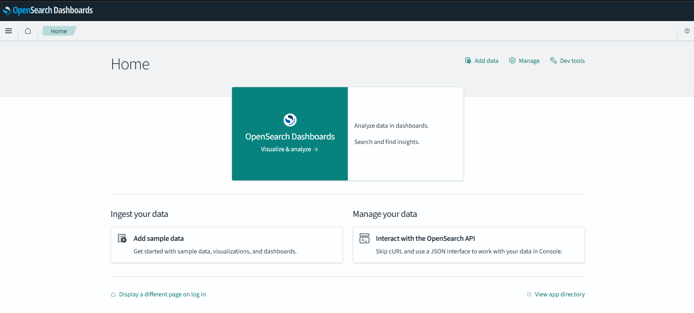

# playground-opensearch



A fresh NestJS service scaffold.

## Getting started

```bash
docker compose up --build
```

The `app` service runs in development mode with file watching enabled, so source code changes are reflected automatically inside the container.

For local Node.js execution without Docker:

```bash
npm install
npm run start:dev
```

## Scripts

- `npm run build`
- `npm run start`
- `npm run start:dev`
- `npm run start:prod`
- `npm run test`
- `npm run test:e2e`
- `npm run lint`
